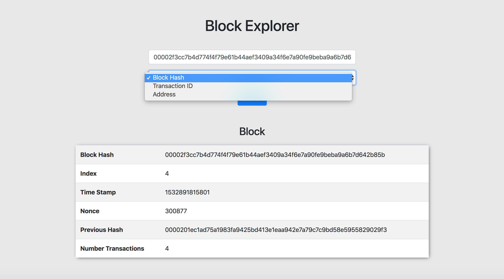
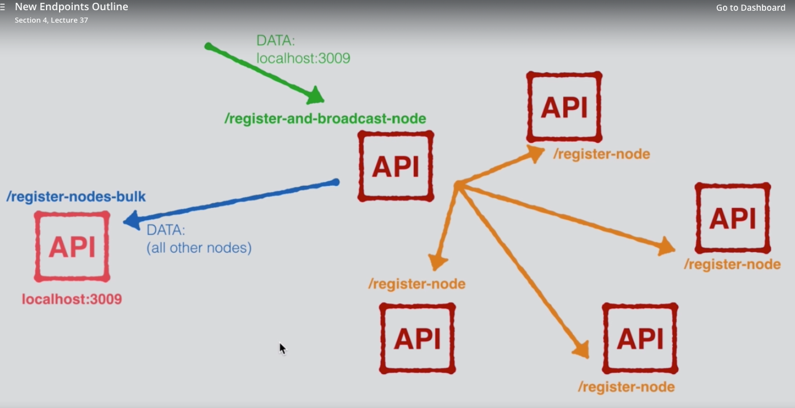
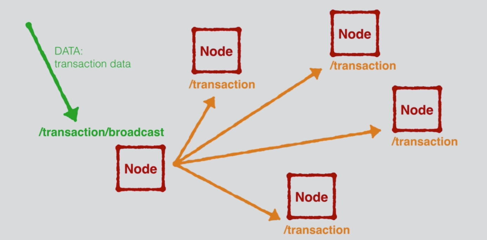
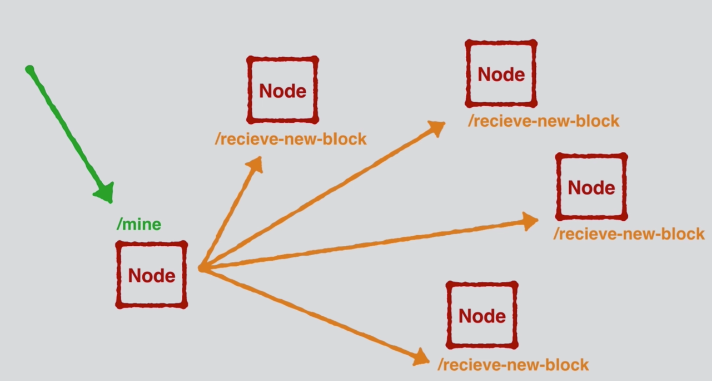

# Blockchain In JavaScript

#### What I have accomplished:
1. Blockchain Data structure.
2. API to to communicate with Data Structure.
3. Turned the API a DECENTRALIZED NETWORK.
4. Syncronize Data among Blocks.
5. Create a CONSENSUS logic to make sure all the blocks are valid and legitimate.
6. Build a Frontend Block Explorer, for data showing.

#### Still to Improve:
- create an Error Handling logic.
- validate Sender has enough funds to send => put logic in createNewTransaction method!
- in createNewBlock method, build an Ethereum-type decentralized application, storing more data (ie. userID).
- move Frontend to Vue CLI frameworks.